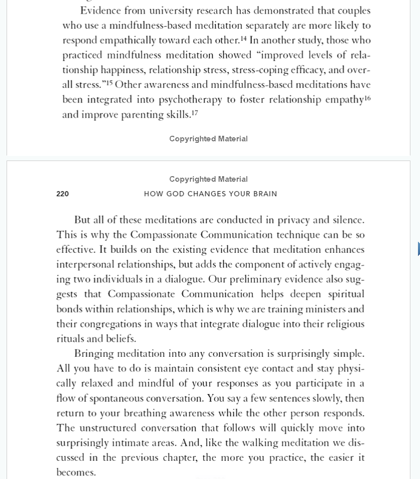

* You can link to another slip **without** including its descriptive text; e.g., [[800000000999]]

* Change default **slip sorting order ** (sticky)--menu: View > Sort By

* Create the **link for the current slip** and place it on the Clipboard--cmd-option-C

* **Rename current slip**--cmd-R

* You can use the following to point to an external file: ''. Note that the part between the parentheses is a path to the item, relative to the The Archive Directory (the path to the folder containing all your slips).
